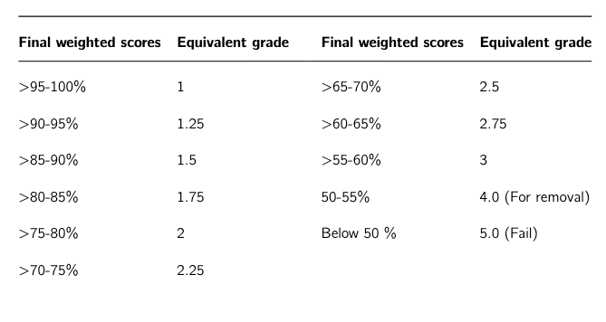

Grading
=======
...
General grading breakdown
-------------------------

Your grade will be determined as follows:

- 50% Exam
- 35% Exercises
- 10% Case study
- 05% Peer rating

.. admonition:: Weekly deadlines

    Generally, exercises are due at the start of class the week following their assignment.
    Please submit the exercises on time in order to keep up with the course.
    You can discuss with the instructors in case you need more time with the exercises.
